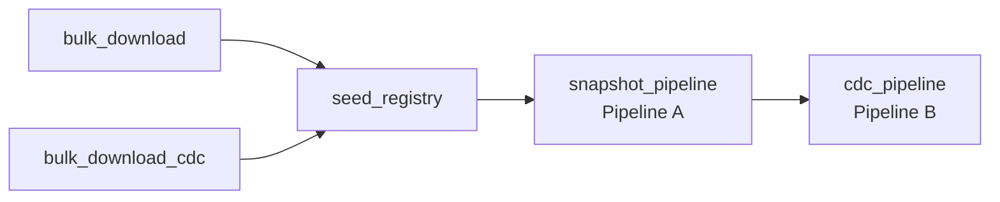

# What runs inside the customer's Databricks workspace

A guide to the Databricks half of the ACC → Databricks connector, for anyone who has not
read the notebooks. Read this before changing anything under `acc-connector/notebooks/`.

Companion document: `2026-09-04-move-databricks-work-to-connector-design.md`, which
proposes moving some of this work back to the connector.

---

## 1. The two tiers

The connector is split across two machines that never share a process:

| Tier | Where it runs | What it may touch |
|---|---|---|
| **Control plane** — `acc-connector/backend/` | our Flask app (EC2) | ACC APIs, Databricks REST, our state store |
| **Data plane** — `acc-connector/notebooks/` | the *customer's* Databricks workspace | the customer's UC Volume and Delta tables |

Two hard rules, recorded in `ADR.md`:

- **Notebooks must never import from `backend/`.** They run on a different machine. The
  only channel between the tiers is Spark conf keys (`acc.catalog`, `acc.dc_snapshot_path`,
  …) and job widgets.
- **No ACC customer data reaches the connector's disk or database.** Data goes
  ACC API → UC Volume, directly. We store config, encrypted tokens and run state only.

Everything below is the data plane.

## 2. How the notebooks get there

`bootstrap_steps.upload_notebooks()` base64s every `.py` under `notebooks/` and imports it
into `/Users/<service-principal-email>/acc/v1/` in the customer's workspace. This happens
once, at bootstrap, per connection.

Two Lakeflow pipelines are then created pointing at two of those notebooks, each carrying
its catalog name in `configuration` so one notebook serves any tenant.

## 3. The sync DAG

Every sync run triggers one Databricks Job with this task graph
(`databricks_client.create_combined_snapshot_workflow`):

The two downloads run in parallel. Everything after is strictly sequential — Pipeline B
depends on Pipeline A having finished, and both depend on the PK registry being populated.

## 4. File by file

### `bulk_downloader.py` — the file mover

Runs as a plain Job task. The connector writes a JSON manifest of
`(signed_url, target_volume_path)` pairs to the volume; this notebook reads it and pulls
each file down.

- 8 concurrent downloads (`acc.download_parallelism`), streamed in 64 KB chunks so driver
  memory stays flat regardless of CSV size.
- `403`/`410` fails fast — the signed URL expired, retrying is pointless, re-run the sync.
- Transient 5xx and network errors retry three times with 2/4/8s backoff.
- On success writes a `_SUCCESS` sentinel; **on any failure deletes the entire run
  folder**, because the pipelines glob across run folders and one half-written CSV would
  silently corrupt a bronze table.

The same notebook serves both the snapshot and CDC download tasks. `download_role`
(`snapshot` | `cdc`) selects which manifest to read — it is passed as a job base parameter
rather than inferred from `taskKey`, because serverless often omits the taskKey tag.

**Why this exists at all:** Data Connector signed URLs need no `Authorization` header. So
the notebook can fetch ACC data without ever holding an ACC token, and the bytes go
straight into the customer's volume without passing through our servers.

### `seed_registry.py` — metadata preparation

A plain Job task, deliberately **not** a declarative pipeline: serverless pipeline planning
cannot reliably persist a Delta MERGE, and the registry must be committed before the
pipelines start. It does three unrelated jobs.

**(a) Seed the PK registry.** Reads `pk_config.json` from the volume (uploaded by the
connector at bootstrap) and MERGEs `{schema, table, pk_columns}` rows into
`_meta_bronze_pk_registry` in batches of 50. Hash-gated — if the file hash matches what is
recorded in `_meta_bronze_schema_versions` and the registry is non-empty, it skips.

**(b) Publish `schema.json`.** Fetches the ACC table schema, preferring the public APS
Schema API (40 service groups, 8 in parallel, via `shared/schema_api_loader.py`) and
falling back to parsing `autodesk_data_extract.zip` out of the export. Writes the merged
document to the volume and records its hash.

**(c) Run the CDC PK audit.** For each CDC CSV on the volume, reads the actual data and
checks the configured primary key: present in the header, no NULL/empty values, unique.
Writes a verdict per table into `_meta_bronze_table_status`. `pk_missing_in_csv` and
`pk_null_values` are blocking; `pk_not_unique` is a warning, because CDC feeds legitimately
carry several versions of the same row and `sequence_by` resolves them.

### `shared/acc_pipeline_common.py` — the brain (1,533 lines)

Shared by both pipelines via `%run`. Two functions matter.

**`prepare_shared_bootstrap()`** runs, in order:

1. `init_config()` — read every `acc.*` key off `spark.conf` into module globals. Re-read
   here rather than at import, because pipeline configuration is not always available when
   `%run` first evaluates the module.
2. Seed the PK registry from `pk_config.json` (belt-and-braces; `seed_registry` already did it).
3. Apply Unity Catalog `COMMENT` statements to the three `_meta_*` tables.
4. Locate `schema.json`, build a PySpark `StructType` per table from it.
5. **Reconcile each schema against the existing bronze table.** New column → add it.
   Type change that is a safe widening (`int→bigint`, `float→double`, …) → apply it.
   Anything else → *keep the old type and warn*; incompatible values become NULL rather
   than failing the run. Column dropped upstream → keep it in the target, fill NULL.
   The whole step is hash-gated on `schema.json` and skipped when nothing changed.

**`gate_table_common()`** decides, per CSV, whether to ingest at all:

| Check fails | Status written | Outcome |
|---|---|---|
| No CSV at the path | `skipped_no_csv` | skip |
| Header unreadable/empty | `csv_unreadable` | skip |
| No registry row and stem matches no known schema | `not_in_schema_json` | skip |
| Registry PK column absent from the header | `pk_missing_in_csv` | skip |

A table not in the registry but whose stem *does* match a known schema is auto-registered
with its first column as the PK (`source = auto_position_1`) — a guess, overridable in
`pk_config.json`.

### `acc_snapshot_pipeline.py` — Pipeline A

The **16 snapshot-only** service groups: those with no `cdc*` mirror (`assets`,
`checklists`, `clashes`, `classifications`, `dailylogs`, `estimates`, `forms`, `iq`,
`issuesbim360`, `markups`, `packages`, `photos`, `relationships`, `reviews`, `submittals`,
`takeoff`).

Each sync delivers a complete snapshot, so it uses
`dlt.create_auto_cdc_from_snapshot_flow()` with SCD Type 1 — Databricks diffs consecutive
snapshots itself. The snapshot version is derived from the ISO timestamp in the run folder
name, so a re-run of an older folder is ignored rather than reprocessed.

Rows with a non-null `deleted_at` are filtered out on read.

> The notebook's own header comment says "10 groups" and is **stale**.
> `shared/service_groups_config.py` is the source of truth.

### `acc_delta_cdc_pipeline.py` — Pipeline B

The **10 official `cdc*` groups** (`cdcadmin`, `cdccost`, `cdcissues`, `cdclocations`,
`cdcmeetingminutes`, `cdcrfis`, `cdcschedule`, `cdcsheets`, `cdcsubmittalsacc`,
`cdctransmittals`).

These arrive as real change feeds, so it uses `dlt.create_auto_cdc_flow()` with:

- `sequence_by` = `adsk_updated_at`, falling back to `updated_at`. **No sequence column
  means the table is skipped** — AUTO CDC cannot order the changes.
- `apply_as_deletes` on `deleted_at IS NOT NULL`, when that column exists.
- A `dlt.expect('pk_not_null', …)` expectation on every PK column.

It re-runs the PK audit per table and refuses to register anything with a blocking status.

The stream reads from the **project** CDC root with `recursiveFileLookup` +
`pathGlobFilter`, not from the individual run folder. That is deliberate: `acc.dc_cdc_path`
changes every sync, and pointing the stream at it would reset the checkpoint each time.

### `shared/service_groups_config.py` — the referee

`issues` and `cdcissues` are the same data. Without a rule, both pipelines would write the
same bronze table and fight. This file draws the line: 16 snapshot-only groups belong to
Pipeline A, 10 `cdc*` groups belong to Pipeline B, and the 10 standard groups that *have* a
CDC mirror (`admin`, `cost`, `issues`, …) are skipped by Pipeline A entirely.

The split is aligned with the official ACC `POST /requests` `serviceGroups` enum.

### `shared/pk_audit_logic.py` — PK validation

Pure helpers plus Spark CSV checks, with **no DLT dependency** — that is what lets both
`seed_registry` (via `%run`) and `acc_pipeline_common` (via `importlib`) use it.

Note `resolve_audit_csv_path()`: CDC volumes hold one folder per export run, so auditing a
`.../project/*/table.csv` glob would report every row as a duplicate. The audit always
resolves down to exactly one physical file first.

Its status constants must stay in sync with the copies in `acc_pipeline_common.py`.

### Not in use

`auto_cdc_pipeline.py` (1,237 lines) and `auto_cdc_cdc_pipeline.py` (1,196 lines) are the
pre-split monolithic pipelines, kept as "legacy rollback". **No pipeline points at them.**
They are still re-uploaded to every customer workspace on every bootstrap.

`acc_pipeline_test.py` is a standalone harness driven by `acc.test_mode` against
hand-prepared fixtures; it needs no bootstrap and is not part of any sync.

## 5. The config contract

The only way the connector talks to a running pipeline. Set per run via
`apply_pipeline_configuration` before the update starts.

| Key | Meaning |
|---|---|
| `acc.catalog` | the customer's Unity Catalog — makes one notebook multi-tenant |
| `acc.dc_snapshot_path` | this run's snapshot folder, `.../data_connector/<project>/<ts>/` |
| `acc.dc_cdc_path` | this run's CDC folder, `.../data_connector_cdc/<project>/<ts>/` |
| `acc.dc_project_id` | scopes registry and version rows |
| `acc.volume_layout` | `legacy` (in production) or `v2` (dated subfolders + Auto Loader) |
| `acc.snapshot_service_groups` / `acc.cdc_service_groups` | comma-separated allowlist; empty means all |
| `acc.test_mode` | suppresses every write to the `_meta_*` tables |

Job widgets carry the rest: `manifest_path`, `cdc_manifest_path`, `download_role`,
`acc_catalog`.

## 6. The three `_meta_*` tables

Created by the connector at bootstrap (`bootstrap_steps.create_meta_tables`), written by
the notebooks at run time. All live in `<catalog>.bronze`.

| Table | Holds |
|---|---|
| `_meta_bronze_pk_registry` | the locked primary key per table, and where it came from |
| `_meta_bronze_table_status` | per-table outcome of the last run: status, error text, CSV header, column diff |
| `_meta_bronze_schema_versions` | SHA-256 of `pk_config.json` and `schema.json`, for change detection |

`_meta_bronze_table_status` is the one to read when a table is missing from bronze. Nothing
in the connector reads it today, so today that means querying it in Databricks by hand.

## 7. Debugging a run

1. **Which task failed?** Open the Job run. The task names map one-to-one onto the DAG
   in §3.
2. **`bulk_download` failed** → check the driver log for `HTTP 403/410`, meaning the signed
   URLs expired between manifest creation and download. Re-run the sync to mint fresh ones.
   The run folder will have been deleted; that is intentional.
3. **A pipeline succeeded but a table is missing** → query
   `_meta_bronze_table_status`. `last_run_status` and `last_error_message` name the exact
   cause and the remediation.
4. **Every table skipped** → look for `resolved data base path is empty` in the pipeline
   log. It means `acc.dc_snapshot_path` / `acc.dc_cdc_path` did not reach the pipeline.
5. **End-of-run counts** → each pipeline emits a `[SUMMARY]` line with `ingested_clean`,
   `schema_changes`, and a count per skip reason.

## 8. Known rough edges

- The `auto_cdc_*` notebooks are dead but still shipped (§4).
- `seed_registry.py` reaches out to the public APS Schema API from inside every customer
  workspace, on every sync, for a document that is identical across all tenants.
- The ACC service-group taxonomy exists in three places: `service_groups_config.py`,
  `seed_registry.DC_ALL_SERVICE_GROUPS`, and `clients/acc/constants.py`.
- The CDC PK audit runs twice — once in `seed_registry`, once again per table inside
  Pipeline B.
- `_apply_table_documentation()` re-issues 16 `COMMENT`/`ALTER COLUMN` statements on every
  pipeline run — 32 per sync across both pipelines — for one-time DDL.
- `_bootstrap_schema_json()`'s docstring claims the connector publishes `schema.json` to
  the volume on every sync. It does not — `seed_registry` is the only writer.

The companion design document proposes fixes for all of these.
