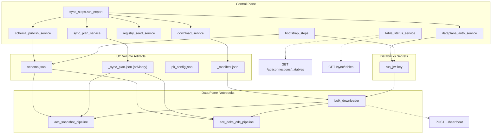

# FR-08 — Data Plane → Control Plane API Migration

**Version:** 1.1  
**Status:** Draft — design decisions locked (grill review 2026-09-08)  
**Date:** 2026-09-08  
**Applies to:** `acc-connector/` (control plane + notebooks)  
**Related documents:**

- [2026-09-08-api-replacement-and-ip-protection.md](../design/2026-09-08-api-replacement-and-ip-protection.md)
- [2026-09-04-move-databricks-work-to-connector-design.md](../design/2026-09-04-move-databricks-work-to-connector-design.md)
- [ARCHITECTURE.md](../design/ARCHITECTURE.md)
- [ADR.md](../design/ADR.md)

---

## 1. Executive Summary

Today, tenant-invariant business logic — APS Schema API fetch, schema ZIP parsing, PK registry
MERGE policy, sync gating decisions, and service-group taxonomy — executes inside every
customer's Databricks workspace via notebooks. That duplicates control-plane code, increases
sync cost, exposes connector IP, and creates drift risk across tiers.

This specification defines the migration to an **API-driven control plane architecture** where:

1. **Core business logic** lives once in `acc-connector/backend/services/` (control plane).
2. **Notebooks** become lightweight Spark/DLT orchestrators that consume **opaque artifacts**
   and optional **internal metadata APIs** — not re-implementations of connector policy.
3. **Sensitive implementation code** is never shipped to or callable from the customer's
   Databricks workspace.

Two delivery patterns apply:

| Pattern | When | Notebook interaction |
|---|---|---|
| **Phase A — orchestration-time** (primary) | Before the Databricks Job starts | Read volume artifacts + Spark conf; **no HTTP** |
| **Phase B — runtime internal APIs** (secondary) | During Job execution, metadata only | Thin HTTP client; run JWT read from **Databricks Secrets** (not Spark conf) |

Customer data (ACC CSV bytes, PK audit row samples) **never** crosses the control-plane
boundary per ADR.

**`_sync_plan.json` is advisory** (see §6.3): the control plane publishes register/skip
intent from schema + registry + manifest file names; notebooks **must** verify CSV headers
at runtime and may only downgrade `register` → `skip`. Ground truth for the UI is
`_meta_bronze_table_status`, not the plan file.

---

## 2. Business Objectives

| ID | Objective | Success indicator |
|----|-----------|-------------------|
| **BO-DP-01** | Single source of truth for tenant-invariant logic | One implementation per concern in control plane |
| **BO-DP-02** | Protect connector IP | No APS fetch, MERGE policy, or schema parsers in notebooks after migration |
| **BO-DP-03** | Preserve sync behaviour | Equivalence tests and production sync outcomes unchanged |
| **BO-DP-04** | Reduce data-plane cost | Zero outbound APS Schema API calls from customer workspaces |
| **BO-DP-05** | Stable contracts | Versioned artifacts and internal API paths; backward-compatible Spark conf |
| **BO-DP-06** | Operational visibility | U2M wizard and M2M portal read table status without Databricks SQL access |

---

## 3. Current Architecture Analysis

### 3.1 Tier boundary (unchanged)

```
┌─────────────────────────────────────────────────────────────────┐
│  Control plane (Flask, EC2)                                      │
│  routes/ → services/ → repositories/ + clients/                  │
│  Orchestrates: OAuth, DC export, manifest, workflow trigger      │
└───────────────────────────┬─────────────────────────────────────┘
                            │ Spark conf keys (acc.*)
                            │ Volume artifacts (JSON, pk_config)
                            │ Optional: /internal/dataplane/v1/*
┌───────────────────────────▼─────────────────────────────────────┐
│  Data plane (customer Databricks workspace)                        │
│  Job tasks: bulk_downloader, pipelines (no seed_registry)       │
│  SDP: acc_snapshot_pipeline, acc_delta_cdc_pipeline              │
└─────────────────────────────────────────────────────────────────┘
```

**Rule (non-negotiable):** `notebooks/` must not `import` from `backend/`. Parameters cross
the boundary as Spark conf, widgets, and volume files only.

### 3.2 Notebook inventory (~5,900 lines shipped today)

| File | ~Lines | Role | Migration posture |
|------|-------:|------|-------------------|
| `bulk_downloader.py` | 231 | Stream signed URLs → UC Volume | **Stay** (customer bytes) |
| `seed_registry.py` | 560 | Schema publish, PK MERGE, CDC PK audit | **Delete** (entire file + workflow task) |
| `shared/acc_pipeline_common.py` | 1,534 | Bootstrap, gating, DLT helpers | **Shrink** (~1,000 lines remain) |
| `shared/schema_api_loader.py` | 111 | Parallel APS Schema API fetch | **Delete** |
| `shared/pk_audit_logic.py` | 290 | Row-level PK audit | **Stay** (customer data) |
| `shared/service_groups_config.py` | 60 | Pipeline routing predicates | **Stay** (routing only) |
| `acc_snapshot_pipeline.py` | 157 | Pipeline A — AUTO CDC FROM SNAPSHOT | **Stay** (DLT) |
| `acc_delta_cdc_pipeline.py` | 317 | Pipeline B — AUTO CDC streaming | **Stay** (DLT) |
| `acc_pipeline_test.py` | 130 | Test-mode fixtures | **Stay** |
| `auto_cdc_pipeline.py` | 1,237 | Legacy monolith | **Delete** |
| `auto_cdc_cdc_pipeline.py` | 1,196 | Legacy monolith | **Delete** |

### 3.3 Existing control-plane counterparts (partial duplication today)

| Notebook logic | Existing CP module | Gap |
|---|---|---|
| Schema ZIP parser | `backend/services/sync/schema_service.py` | APS API fetch + volume publish missing |
| PK registry MERGE (auto_position_1) | `registry_service._seed_registry_from_schema()` | explicit_pk_config MERGE only in notebook |
| Manifest builder | `download_service._phase2_via_notebook()` | Complete |
| Service-group list (40 enums) | `backend/clients/acc/constants.py` | Not passed to notebooks via conf |
| Table status read | — | No portal API |

### 3.4 Sync workflow DAG (target)

```text
run_export() [CP]
  → DC job + manifest write
  → schema publish + registry seed + sync plan (Phase A)
  → write run JWT to Databricks Secrets
  → trigger combined workflow:
       bulk_download ──┐
       bulk_download_cdc ──┤ (parallel)
       snapshot_pipeline (SDP)  ← depends on both downloads
       cdc_pipeline (SDP)
```

Migration moves work **left** into `run_export()` and **removes** the `seed_registry`
workflow task (one fewer Job task). CDC row-level PK audit stays in Pipeline B only.

---

## 4. Target Architecture

### 4.1 Control-plane module layout (new / extended)

```
backend/services/dataplane/
├── schema_publish_service.py    # APS fetch, DC ZIP fallback, volume publish, hash row
├── registry_seed_service.py     # Unified PK registry MERGE (explicit + auto + manifest)
├── sync_plan_service.py         # Per-run advisory _sync_plan.json
├── table_status_service.py      # Read _meta_bronze_table_status for portal + U2M
└── dataplane_auth_service.py    # Run JWT mint + Databricks Secrets write

backend/routes/
├── dataplane_routes.py          # /internal/dataplane/v1/* (Phase B heartbeat)
├── connection_routes.py         # GET /api/connections/{id}/tables (M2M portal)
└── sync_routes.py               # GET /sync/tables (U2M wizard; shared service)
```

Bootstrap also provisions a **Databricks secret scope** per connection (or per workspace)
with READ granted to the sync job service principal. See §6.5 and §8.2.

Existing modules absorb shared algorithms (no duplication after migration):

- `backend/services/sync/schema_service.py` — ZIP parser, shape detectors, `_derive_position_1_pks`
- `backend/services/sync/registry_service.py` — SQL MERGE primitives
- `backend/services/sync/download_service.py` — manifest creation
- `backend/services/provisioning/bootstrap_steps.py` — UC COMMENT DDL (one-time)

### 4.2 Integration point: `sync_steps.run_export()`

All Phase A functions run **inside** `run_export()` after manifest write and **before**
workflow trigger. Order:

| Step | Control-plane function | Output artifact / side effect |
|------|------------------------|-------------------------------|
| 1 | `download_service._phase2_via_notebook()` | `_manifest.json` on volume |
| 2 | `schema_publish_service.ensure_schema_on_volume()` | `{volume}/schema.json` + hash in `_meta_bronze_schema_versions` |
| 3 | `registry_seed_service.seed_from_pk_config()` | Rows in `_meta_bronze_pk_registry` via SQL warehouse |
| 4 | `registry_seed_service.seed_from_schema()` | auto_position_1 rows (if not already present) |
| 5 | `registry_seed_service.seed_from_manifest()` | auto_position_1 rows for manifest `file_name` stems not yet in registry |
| 6 | `sync_plan_service.publish_sync_plan()` | `{volume}/_sync_plan.json` (advisory) |
| 7 | `dataplane_auth_service.write_run_jwt()` | Overwrites Databricks secret key `run_jwt` in connection scope |
| 8 | *(bootstrap only)* `bootstrap_steps.create_meta_tables()` | UC COMMENT metadata |

Immediately after step 7, `sync_steps` triggers the combined workflow.

Extended Spark conf keys (backward compatible):

| Key | Set by | Notebook uses |
|-----|--------|---------------|
| `acc.catalog` | sync_steps | unchanged |
| `acc.dc_snapshot_path` / `acc.dc_cdc_path` | sync_steps | unchanged |
| `acc.sync_plan_path` | sync_steps | **new** — path to advisory plan file |
| `acc.service_groups_snapshot` / `acc.service_groups_cdc` | sync_steps from `constants.py` | **new** — JSON allowlists |
| `acc.download_parallelism` | sync_steps | config passthrough (not algorithm) |
| `acc.dataplane_secret_scope` | sync_steps | **new** — scope name for `run_jwt` (Phase B) |

**Do not** pass the run JWT via Spark conf (`acc.run_jwt` is **not** used).

### 4.3 Phase B — internal API surface

Base path: `/internal/dataplane/v1`  
Auth: short-lived **run JWT** minted at workflow start, scoped to `connection_id` + `run_id`.
The connector writes the JWT to a **Databricks secret scope** (key `run_jwt`, overwritten each
sync run) before triggering the workflow. Notebooks read it via `dbutils.secrets.get` — **never**
via Spark conf. Not public; not documented to customers.

| Method | Endpoint | Purpose |
|--------|----------|---------|
| `POST` | `/runs/{run_id}/heartbeat` | Task progress telemetry (**v1 — required** for `bulk_downloader`) |
| `GET` | `/runs/{run_id}/sync-plan` | Optional runtime plan fetch (prefer volume file) |

Portal-facing (session auth):

| Method | Endpoint | Auth scope | Purpose |
|--------|----------|------------|---------|
| `GET` | `/api/connections/{connection_id}/tables` | M2M hub session | Table status metadata |
| `GET` | `/sync/tables` | U2M user session | Same payload shape; `user_id`-scoped |

---

## 5. Complete Replacement Map

Legend: **A** = Phase A artifact (orchestration-time), **B** = Phase B API, **Stay** = remains in notebook, **Del** = delete notebook code.

### 5.1 `seed_registry.py` (entire file)

| Notebook code | ~Lines | Control-plane function | Delivery | Notebook after |
|---|---:|---|---|---|
| Entire file | 560 | See rows below + §5.2 | A | **Del** — remove from repo, upload list, and workflow |

All responsibilities below move to control plane before workflow trigger. CDC row-level PK
audit is **not** retained as a separate job task; Pipeline B (`audit_table_pk`) is the sole
CDC auditor.

| Former notebook concern | Control-plane replacement |
|---|---|
| APS Schema API fetch | `schema_publish_service.fetch_merged_schema()` |
| Schema ZIP parse + volume write | `schema_publish_service.ensure_schema_on_volume()` |
| PK registry MERGE | `registry_seed_service` |
| `DC_ALL_SERVICE_GROUPS` | `acc/constants.py` → Spark conf |
| CDC pre-audit (`_run_cdc_pk_audit`) | **Dropped** — Pipeline B only |
| CDC path discovery | `sync_plan_service` (paths in advisory plan) |

### 5.2 `shared/acc_pipeline_common.py`

| Notebook code | ~Lines | Control-plane function | Delivery | Notebook after |
|---|---:|---|---|---|
| `_seed_pk_registry_from_config()` | 140 | `registry_seed_service.seed_from_pk_config()` | A | **Del** |
| `_bootstrap_schema_json()` | 60 | Connector-published `schema.json` | A | **Del** |
| `_load_schema_doc_from_zip_bytes()` | 35 | `schema_service._load_schema_doc_from_zip()` | A | **Del** |
| `_merge_per_domain_schemas()` | 20 | `schema_publish_service.merge_per_domain()` | A | **Del** |
| `_apply_table_documentation()` | 45 | `bootstrap_steps.create_meta_tables()` | A (bootstrap) | **Del** |
| `_delta_upsert_config_version()` | 30 | `registry_seed_service.record_config_hash()` | A | **Del** |
| `prepare_shared_bootstrap()` | 70 | Reads volume artifacts only | A | **Stay** (slim) |
| `gate_table_common()` | 90 | `sync_plan_service.gate_table()` pre-computes | A + Stay | **Stay** — apply advisory plan; mandatory header/PK verify; downgrade only |
| `_insert_registry_row()` / `_delta_merge_registry_rows()` | 15 | `registry_seed_service.seed_from_manifest()` | A | **Del** |
| `_build_evolved_schema()` | 55 | — | — | **Stay** |
| `read_csv_df()`, DLT helpers | 200+ | — | — | **Stay** |

### 5.3 `shared/schema_api_loader.py`

| Notebook code | Lines | Control-plane function | Delivery | Notebook after |
|---|---:|---|---|---|
| Entire file | 111 | `schema_publish_service.fetch_merged_schema()` | A | **Del** (file removed from upload) |

### 5.4 `bulk_downloader.py`

| Notebook code | Replace? | Control-plane role | Notebook after |
|---|---|---|---|
| Manifest read + parallel download | **Stay** | CP creates manifest | Thin executor |
| Heartbeat telemetry | **Stay** | `dataplane_client.post_heartbeat()` | Reads JWT from Secrets |
| Retry/backoff constants | **Config only** | Passed via `acc.download_*` conf | **Stay** |
| `_SUCCESS` sentinel + failure cleanup | **Stay** | — | **Stay** |

### 5.5 Pipeline notebooks

| Notebook code | Replace? | Control-plane role |
|---|---|---|
| `dlt.create_auto_cdc_from_snapshot_flow()` | **Stay** | CP passes paths + sync plan |
| `dlt.create_auto_cdc_flow()` + streaming | **Stay** | CP passes CDC paths + plan |
| `_register_*_table()` orchestration | **Stay** | Plan lists register/skip |
| `audit_table_pk()` | **Stay** | Row-level audit stays in DP |

### 5.6 Legacy and removed notebooks

| File | Action |
|------|--------|
| `seed_registry.py` | **Delete** from repo, upload list, and workflow task definitions |
| `auto_cdc_pipeline.py` | **Delete** from repo and workspace upload |
| `auto_cdc_cdc_pipeline.py` | **Delete** from repo and workspace upload |

---

## 6. Control-Plane Function Specifications

### 6.1 `schema_publish_service`

**Purpose:** Fetch, normalize, cache, and publish ACC schema metadata to the UC Volume.

| Function | Inputs | Outputs | Errors |
|----------|--------|---------|--------|
| `fetch_merged_schema(acc_token_getter)` | APS token | `{schema_doc, source, schema_hash}` | `SchemaAPIError` → fallback chain |
| `fetch_schema_from_dc_zip(manifest, get_acc_token)` | Manifest with signed URLs | `zip_bytes` (in memory only) | Log + next fallback |
| `merge_per_domain(docs: list[dict])` | Per-group API responses | Normalized 3-level doc | `SchemaShapeError` |
| `ensure_schema_on_volume(dbx, target, manifest?)` | Connection target, optional manifest | Writes `schema.json`, upserts hash row | Non-fatal on fallback exhaustion (log + continue) |

**Schema fallback chain** (runs at orchestration time, before CSVs are on the volume):

1. **APS Schema API** (primary) — parallel fetch in control plane.
2. **DC export ZIP** — connector downloads `autodesk_data_extract.zip` (or `docs/schemas/*`
   only) via manifest signed URL; parses `schemas/*.json` in memory via
   `schema_service._load_schema_doc_from_zip()`; **does not** persist customer CSV bytes
   to connector disk or DB.
3. **Stale volume `schema.json`** — use existing file from a prior sync; log warning.
4. Continue sync if a usable schema exists; otherwise warn (tables may skip).

**Dependencies:** `schema_service`, `DatabricksClient.put_file`, `acc/constants.py` service groups, APS Schema API, DC signed URLs from manifest.

**Cache policy:** Deploy-scoped in-memory cache (OQ-02 resolved). Invalidate on connector process restart/deploy; no TTL in v1.

### 6.2 `registry_seed_service`

**Purpose:** Single PK registry seeding path for both explicit and auto-derived PKs.

| Function | Inputs | Outputs | Errors |
|----------|--------|---------|--------|
| `seed_from_pk_config(dbx, warehouse_id, catalog, pk_config_path)` | pk_config.json on volume | MERGE rows, `source=explicit_pk_config` | `RegistrySeedError` if zero tables |
| `seed_from_schema(dbx, warehouse_id, catalog, schema_doc)` | schema.json doc | MERGE rows, `source=auto_position_1`, insert-only | Warning if zero rows |
| `seed_from_manifest(dbx, warehouse_id, catalog, manifest, schema_doc)` | `_manifest.json` file names + schema doc | MERGE rows for resolvable stems; insert-only | Warning if zero new rows |
| `record_config_hash(dbx, warehouse_id, catalog, config_type, hash, path)` | Hash metadata | Upsert `_meta_bronze_schema_versions` | Log on failure |

**`seed_from_manifest` policy:** For each CSV `file_name` in the manifest, derive
`(schema, table)` using the same stem logic as notebooks (implemented once in
`schema_service`). If the table exists in `schema_doc`, seed PK = column at
`ordinal_position` 1. If the stem is unresolvable or the table is absent from
`schema_doc`, do not insert — `sync_plan_service` marks `skip` / `pending_schema`.
**Notebooks must not execute registry MERGE SQL** (FR-DP-05).

**MERGE policy (explicit_pk_config):**

- Match on `(catalog, schema, table)`.
- Update when `source IN ('auto_position_1', 'explicit_pk_config')` AND PK columns or source differ.
- Never overwrite `manual_*` sources.

**Dependencies:** `registry_service`, `schema_service._derive_position_1_pks`, SQL warehouse.

### 6.3 `sync_plan_service`

**Purpose:** Pre-compute per-table sync **intent** so notebooks apply opaque plans instead of
re-deriving gating policy. The plan is **advisory** — see notebook contract below.

| Function | Inputs | Outputs |
|----------|--------|---------|
| `gate_table(table_ctx)` | schema/table name, registry row, manifest `file_name` (no CSV row data) | `{action: register\|skip, skip_reason, pk_columns, schema, table}` |
| `publish_sync_plan(dbx, target, mode, decisions)` | List of gate results | Writes immutable `{volume}/_sync_plan.json` |

**`_sync_plan.json` schema (version 1):**

```json
{
  "plan_version": 1,
  "authority": "advisory",
  "requires_header_verify": true,
  "connection_id": "…",
  "run_id": 123,
  "mode": "snapshot",
  "created_at": "2026-09-08T12:00:00Z",
  "tables": [
    {
      "csv_name": "issues.csv",
      "schema": "issues",
      "table": "issues",
      "action": "register",
      "pk_columns": ["id"],
      "skip_reason": null
    },
    {
      "csv_name": "orphan.csv",
      "action": "skip",
      "skip_reason": "not_in_schema_json"
    }
  ]
}
```

**Advisory plan contract (notebook behaviour):**

| Plan `action` | Notebook behaviour |
|---------------|-------------------|
| `skip` | Skip immediately (trust CP intent) |
| `register` | **Must** read CSV header and verify PK columns present |
| Header verify fails | Downgrade to skip; write `_meta_bronze_table_status` — **do not** mutate plan file |
| Header verify passes | Proceed to DLT registration |

Notebooks may only **downgrade** (`register` → `skip`), never upgrade (`skip` → `register`).
The plan file is **immutable** after CP writes it. Portal/UI reads
`_meta_bronze_table_status` for actual outcomes (BO-DP-06).

**Note:** At orchestration time CSVs are not on the volume yet (`ENABLE_NOTEBOOK_DOWNLOAD=true`).
CP gating uses manifest file names + `schema.json` + registry only. Local header reads in
notebooks are mandatory at runtime when files exist.

### 6.4 `table_status_service`

**Purpose:** Read `_meta_bronze_table_status` for portal and U2M wizard display.

| Function | Inputs | Outputs |
|----------|--------|---------|
| `list_table_status(dbx, connection)` | connection record (M2M) | `[{schema, table, last_run_status, last_error_message, last_synced_at}]` |
| `list_table_status_for_user(dbx, user_id)` | U2M user session | Same shape for the user's active connection/catalog |

### 6.5 `dataplane_auth_service`

**Purpose:** Mint per-run JWTs and deliver them to the data plane without exposing them in
Spark conf.

| Function | Inputs | Outputs |
|----------|--------|---------|
| `ensure_secret_scope(dbx, connection)` | connection / bootstrap context | Creates scope if missing; grants READ to job SP |
| `write_run_jwt(dbx, scope, run_id, connection_id, hub_id, exp)` | Run context | Overwrites secret key `run_jwt` in scope |
| `mint_run_jwt(...)` | Claims | Signed JWT string |

**Scope naming:** `acc-connector-{connection_id}` (or one scope per workspace — pick one in
implementation; document in `sourcemap.md`).

**Lifecycle:** Single key `run_jwt`, **overwritten** each sync run immediately before
workflow trigger. Short `exp` (workflow max wait + buffer). Bootstrap creates scope; each
run refreshes the value.

---

## 7. API Contracts

### 7.1 Internal dataplane API (Phase B)

**Authentication:**

```
Authorization: Bearer <run_jwt>
```

JWT claims: `connection_id`, `run_id`, `hub_id`, `exp` (≤ workflow max wait + buffer).

**JWT delivery to notebooks:** Databricks secret scope (key `run_jwt`). Scope name passed via
`acc.dataplane_secret_scope` Spark conf. **Not** `acc.run_jwt`.

**Common error envelope:**

```json
{
  "error": {
    "code": "INVALID_RUN",
    "message": "Run 123 not found or expired"
  }
}
```

| HTTP | Code | When |
|------|------|------|
| 401 | `UNAUTHORIZED` | Missing/invalid JWT |
| 403 | `FORBIDDEN` | JWT connection_id mismatch |
| 404 | `NOT_FOUND` | Run or connection not found |
| 422 | `VALIDATION_ERROR` | Invalid request body |
| 500 | `INTERNAL_ERROR` | Unexpected failure (no stack trace in body) |

#### `POST /internal/dataplane/v1/runs/{run_id}/heartbeat`

**Request:**

```json
{
  "task": "bulk_download",
  "state": "running",
  "message": "12/40 files",
  "metrics": {
    "completed": 12,
    "total": 40,
    "bytes": 1048576
  }
}
```

**Response:** `{ "ok": true, "run_id": 123 }`

**Must not contain:** CSV rows, signed URLs, tokens, APS responses.

#### `GET /internal/dataplane/v1/runs/{run_id}/sync-plan`

**Response:**

```json
{
  "plan_version": 1,
  "sync_plan_path": "/Volumes/.../acc_bronze_volume/_sync_plan.json",
  "tables": [ "...same as artifact..." ]
}
```

Prefer volume file in notebooks; this endpoint is for debugging and optional runtime refresh.

### 7.2 Portal and U2M APIs

#### `GET /api/connections/{connection_id}/tables` (M2M)

**Auth:** Portal session; hub-scoped (404 if connection not in user's hub).

**Response:**

```json
{
  "connection_id": "…",
  "tables": [
    {
      "schema": "issues",
      "table": "issues_attachments",
      "last_run_status": "pk_missing_in_csv",
      "last_error_message": "PK column(s) ['attachment_id'] missing from CSV header",
      "last_synced_at": "2026-09-08T11:30:00Z"
    }
  ]
}
```

#### `GET /sync/tables` (U2M)

**Auth:** Wizard session; scoped to the authenticated user's bootstrap catalog.

Same response shape as M2M (without `connection_id` when not applicable). Implemented via
shared `table_status_service` — FR-DP-10.

**Must not contain:** PK audit row samples, CSV content, signed URLs.

### 7.3 API versioning

| Surface | Version mechanism |
|---------|-------------------|
| Internal dataplane | URL prefix `/internal/dataplane/v1` |
| `_sync_plan.json` | `plan_version` field |
| Spark conf | Additive keys only; never rename existing `acc.*` keys without ADR |

---

## 8. Notebook Client Patterns

### 8.1 Phase A — artifact reader (primary)

Notebooks read pre-computed artifacts; no HTTP required for gating.

```python
# Pseudocode — acc_pipeline_common.py after migration
plan_path = spark.conf.get('acc.sync_plan_path', '')
if plan_path:
    plan = json.loads(_read_volume_bytes(plan_path))
    assert plan.get('authority') == 'advisory'
    decision = _lookup_table(plan, csv_name)
    if decision['action'] == 'skip':
        _apply_skip(decision['skip_reason'])
        return
    # action == 'register': fall through to mandatory header/PK verify below
header = _read_csv_header(glob_path)
# ... verify pk_columns ⊆ header; on failure skip + _record_status() only ...
# Fall back to legacy gate_table_common() if plan missing (FR-DP-11 backward compat)
```

### 8.2 Phase B — thin HTTP client + Databricks Secrets

```python
# Pseudocode — shared/dataplane_client.py (new, ~50 lines, no business logic)
scope = spark.conf.get('acc.dataplane_secret_scope', '')
run_jwt = dbutils.secrets.get(scope=scope, key='run_jwt')

def post_heartbeat(run_jwt, run_id, task, state, message, metrics=None):
    requests.post(
        f'{CP_BASE}/internal/dataplane/v1/runs/{run_id}/heartbeat',
        headers={'Authorization': f'Bearer {run_jwt}'},
        json={...},
        timeout=10,
    )
```

**Retry policy:** 3 attempts, exponential backoff (2s, 4s, 8s); failures are non-fatal (log only).

**JWT source:** Databricks secret scope key `run_jwt` (overwritten by control plane each run).
Scope name via `acc.dataplane_secret_scope`. **Do not** use Spark conf for the token value.

---

## 9. IP Protection Requirements

### 9.1 Must never ship to customer workspace

| Category | Examples |
|----------|----------|
| APS integration | OAuth, Schema API parallel fetch, signed-URL minting |
| Schema policy | APS-first vs ZIP fallback, merge of 40 service groups |
| PK registry policy | MERGE conditions, explicit vs auto source rules |
| Sync orchestration | Watermark math, rate limits, workflow DAG assembly |
| Canonical service-group enums | Full 40-group list (conf passthrough only) |

### 9.2 Must never cross tier boundary (customer data)

- ACC CSV row content
- PK audit duplicate-key samples with values
- Signed URLs in API responses or logs after manifest write
- ACC tokens in notebooks (bulk_downloader uses unsigned URLs by design)

### 9.3 API response limits

| May return | Must not return |
|------------|-----------------|
| Status metadata, skip reasons | Python source of gating algorithms |
| `{plan_version, tables: [{action, skip_reason}]}` | Raw APS Schema API dumps |
| `{ok: true, run_id}` | Secrets, JWT signing keys |

---

## 10. Explicit Non-Replacements

Do **not** API-ify these responsibilities:

| Responsibility | Reason |
|----------------|--------|
| `bulk_downloader` byte streaming | Would route customer data through control plane |
| `audit_pk_csv()` row scans | Would export customer data to control plane |
| `dlt.create_auto_cdc_*` | DLT requires in-pipeline decorators |
| `_build_evolved_schema()` | Requires live Unity Catalog in Spark |
| ACC OAuth / DC job creation | Already control plane only |

---

## 11. Functional Requirements

| ID | Requirement |
|----|-------------|
| **FR-DP-01** | Control plane publishes `schema.json` to volume on every sync before workflow trigger |
| **FR-DP-02** | Control plane seeds PK registry (explicit + auto) before workflow trigger |
| **FR-DP-03** | Control plane publishes advisory `_sync_plan.json` with per-table register/skip intent |
| **FR-DP-04** | Notebooks must not call APS Schema API after migration |
| **FR-DP-05** | Notebooks must not execute PK registry MERGE SQL after migration (including runtime `_insert_registry_row`) |
| **FR-DP-06** | Service-group taxonomy has one canonical source in `acc/constants.py` |
| **FR-DP-07** | UC table comments applied once at bootstrap, not every pipeline run |
| **FR-DP-08** | Legacy `auto_cdc_*` and `seed_registry` notebooks removed from upload list |
| **FR-DP-09** | Internal dataplane routes require run JWT from Databricks Secrets; portal/U2M routes require session scope |
| **FR-DP-10** | U2M sync path uses same shared steps as M2M (no divergent notebook logic) |
| **FR-DP-11** | Backward compatibility: sync succeeds if `_sync_plan.json` absent (legacy `gate_table_common` fallback) |
| **FR-DP-12** | All API and artifact responses exclude customer data per §9 |
| **FR-DP-13** | Run JWT is never passed via Spark conf; only scope name `acc.dataplane_secret_scope` |
| **FR-DP-14** | Notebooks treat plan as advisory: mandatory header verify on `register`; outcomes in `_meta_bronze_table_status` only |

---

## 12. Non-Functional Requirements

| ID | Requirement |
|----|-------------|
| **NFR-DP-01** | Phase A steps add ≤ 30s p95 to sync orchestration (excluding APS API latency) |
| **NFR-DP-02** | Schema API failure must not fail sync when DC ZIP or stale volume fallback available |
| **NFR-DP-03** | Registry seed failure is fatal before workflow trigger (same as today) |
| **NFR-DP-04** | Logs redact signed URLs, JWTs, APS error bodies |
| **NFR-DP-05** | Unit tests use stdlib `unittest`; update equivalence tapes in same commit |
| **NFR-DP-06** | Notebook line count shipped ≤ 2,600 after migration |
| **NFR-DP-07** | Combined sync workflow has ≤ 4 tasks (2 downloads + 2 pipelines; no `seed_registry`) |

---

## 13. Implementation Plan

Each step is independently shippable and revertable.

| Order | Change | CP modules | Notebook / workflow impact | Depends |
|------:|--------|------------|---------------------------|---------|
| 1 | Delete legacy `auto_cdc_*` + `seed_registry` | — | Remove 3 files from upload; drop workflow task | — |
| 2 | Move UC comments to bootstrap | `bootstrap_steps` | Remove `_apply_table_documentation` | — |
| 3 | Connector publishes `schema.json` (APS → DC ZIP → stale) | `schema_publish_service` | Delete `schema_api_loader.py` | — |
| 4 | Connector seeds PK registry (+ manifest stems) | `registry_seed_service` | Remove MERGE from `acc_pipeline_common` | 3 |
| 5 | Single service-group taxonomy | `constants.py`, `sync_steps` | Remove `DC_ALL_SERVICE_GROUPS`; conf passthrough | 3 |
| 6 | Publish advisory `_sync_plan.json` | `sync_plan_service` | Slim `gate_table_common` to plan reader + header verify | 4 |
| 7 | Databricks secret scope + per-run JWT | `dataplane_auth_service`, `bootstrap_steps` | `acc.dataplane_secret_scope` conf | — |
| 8 | Table status API (M2M + U2M) | `table_status_service`, routes | Minimal UI on portal + wizard | — |
| 9 | Heartbeat API + `dataplane_client` | `dataplane_routes` | `bulk_downloader` reads JWT from Secrets | 7 |
| 10 | Workflow DAG: pipelines depend on downloads | `databricks_client` | Remove `seed_registry` task; rewire `depends_on` | 1 |

### 13.1 Files to create

| Path | Purpose |
|------|---------|
| `backend/services/dataplane/schema_publish_service.py` | Schema fetch, DC ZIP fallback, volume publish |
| `backend/services/dataplane/registry_seed_service.py` | Unified registry seeding (+ manifest stems) |
| `backend/services/dataplane/sync_plan_service.py` | Advisory sync plan builder |
| `backend/services/dataplane/table_status_service.py` | Portal + U2M status reader |
| `backend/services/dataplane/dataplane_auth_service.py` | Run JWT mint + Databricks Secrets write |
| `backend/routes/dataplane_routes.py` | Internal heartbeat API blueprint |
| `notebooks/shared/dataplane_client.py` | Thin HTTP client (~50 lines) |
| `tests/test_schema_publish_service.py` | Unit tests |
| `tests/test_registry_seed_service.py` | Unit tests |
| `tests/test_sync_plan_service.py` | Unit tests |
| `tests/test_dataplane_auth_service.py` | JWT + scope tests |
| `tests/test_dataplane_routes.py` | Route auth tests |

### 13.2 Files to modify

| Path | Change |
|------|--------|
| `backend/services/sync/sync_steps.py` | Phase A services + JWT write before workflow trigger |
| `backend/services/provisioning/bootstrap_steps.py` | UC comments; secret scope; notebook upload list |
| `backend/clients/databricks_client.py` | Remove `seed_registry` task; pipelines depend on downloads |
| `notebooks/shared/acc_pipeline_common.py` | Remove bootstrap/seed/MERGE; advisory plan + header verify |
| `notebooks/bulk_downloader.py` | Heartbeat via `dataplane_client` |
| `backend/routes/sync_routes.py` | `GET /sync/tables` |
| `backend/routes/connection_routes.py` | `GET /api/connections/{id}/tables` |
| `static/app.js`, `static/portal.js` | Minimal table status panels |
| `scripts/smoke_check.py` | Updated notebook list |
| `docs/design/sourcemap.md` | New file entries |

### 13.3 Files to delete

| Path |
|------|
| `notebooks/seed_registry.py` |
| `notebooks/shared/schema_api_loader.py` |
| `notebooks/auto_cdc_pipeline.py` |
| `notebooks/auto_cdc_cdc_pipeline.py` |

---

## 14. Verification

### 14.1 Code review checklist

- [ ] No `import` from `backend/` in any file under `notebooks/`
- [ ] No APS Schema API URL or parallel fetch in notebooks
- [ ] No PK registry MERGE SQL in notebooks (including `_insert_registry_row`)
- [ ] No duplicate `_load_schema_doc_from_zip` in notebooks
- [ ] `seed_registry.py` absent from repo and upload list
- [ ] Workflow has no `seed_registry` task; pipelines depend on download tasks
- [ ] Run JWT not present in Spark conf (only `acc.dataplane_secret_scope`)
- [ ] `bootstrap_steps.upload_notebooks()` excludes deleted files
- [ ] API responses contain no CSV rows, signed URLs, tokens, or raw schema dumps
- [ ] Unit tests assert schema publish + registry seed run **before** workflow trigger
- [ ] `_sync_plan.json` includes `authority: advisory` and is not modified by notebooks

### 14.2 Test cases (summary)

| ID | Area | Assertion |
|----|------|-----------|
| TC-DP-01 | Schema publish | `schema.json` written to volume; hash row upserted |
| TC-DP-02 | Schema fallback | APS failure → DC ZIP in-memory path succeeds |
| TC-DP-02b | Schema fallback | APS + ZIP failure → stale volume schema used with warning |
| TC-DP-03 | Registry seed | explicit_pk_config + manifest stems MERGE before workflow |
| TC-DP-04 | Sync plan | Advisory `_sync_plan.json`; notebook downgrades on bad header |
| TC-DP-05 | Notebook shrink | smoke_check notebook list matches upload set (no `seed_registry`) |
| TC-DP-06 | Portal API | cross-hub connection returns 404 |
| TC-DP-06b | U2M API | `GET /sync/tables` returns status for session user |
| TC-DP-07 | Run JWT | invalid JWT on heartbeat returns 401; token read from Secrets not conf |
| TC-DP-08 | Equivalence | `test_sync_steps.py` tape updated, behaviour preserved |
| TC-DP-09 | Workflow DAG | 4 tasks; snapshot pipeline depends on both download tasks |

---

## 15. Expected Outcome

| Metric | Before | After |
|--------|-------:|------:|
| Notebook lines shipped | ~5,900 | ~2,600 |
| Sync workflow tasks | 5 | 4 |
| Outbound APS calls from data plane per sync | 40 | 0 |
| PK registry MERGE implementations | 2 | 1 |
| Schema ZIP parser implementations | 2 | 1 |
| Service-group enum copies | 3 | 1 canonical + conf |
| COMMENT statements per sync | 32 | 0 |
| Table status visible outside Databricks | no | yes (M2M + U2M) |
| CDC PK audit passes per sync | 2 | 1 (Pipeline B only) |

---

## 16. Resolved design decisions (grill review 2026-09-08)

| ID | Question | Decision |
|----|----------|----------|
| **RD-01** | `_sync_plan.json` authority | **Advisory** — notebooks mandatory header/PK verify; downgrade `register`→`skip` only; plan immutable; status table = UI truth |
| **RD-02** | Runtime registry discovery | **Manifest-based pre-seed** in CP (`seed_from_manifest`); no notebook MERGE |
| **RD-03** | `seed_registry` workflow task | **Removed** — file deleted from repo |
| **RD-04** | Schema fallback (NFR-DP-02) | APS → CP DC ZIP fetch (in memory) → stale volume `schema.json` → warn |
| **RD-05** | Heartbeat JWT delivery | **Databricks Secrets** key `run_jwt` (not Spark conf) |
| **RD-06** | JWT lifecycle | Single key, **overwritten** each run before workflow trigger |
| **RD-07** | Table status API surface (OQ-03) | **Both U2M + M2M** via shared `table_status_service` |
| **RD-08** | Phase B heartbeat in v1 (OQ-04) | **Yes** — `bulk_downloader` heartbeats; portal table status also v1 |
| **RD-09** | Schema cache (OQ-02) | **Deploy-scoped** in-memory; no TTL in v1 |
| **RD-10** | CDC pre-audit (OQ-01) | **Dropped** — Pipeline B (`audit_table_pk`) is sole CDC auditor |

---

## 17. Approval

| Role | Name | Date | Decision |
|------|------|------|----------|
| Engineering | | | |
| Product | | | |
| Security | | | |

Confirm:

1. Phase A (artifact-based replacement) is acceptable for v1.
2. Phase B heartbeat (Secrets-backed JWT) and portal/U2M table status ship in v1.
3. Remaining notebook code (~2.6k lines) is an acceptable minimum for Spark/DLT execution.
4. `seed_registry` notebook and workflow task are removed (not shrunk).

---

## Appendix A — Master Traceability Matrix

**Notebook Code → Control Plane Function → API / Artifact → Notebook Consumer**

| Notebook location | Control-plane function | Delivery | Notebook call / read |
|---|---|---|---|
| `seed_registry` (entire file) | Phase A services (see below) | — | **Deleted** |
| `acc_pipeline_common._seed_pk_registry_from_config` | `registry_seed_service.seed_from_pk_config` | A | `_load_registry()` |
| `acc_pipeline_common._insert_registry_row` | `registry_seed_service.seed_from_manifest` | A | **Deleted** |
| `acc_pipeline_common._bootstrap_schema_json` | `schema_publish_service.ensure_schema_on_volume` | A | `_load_typed_schemas()` |
| `acc_pipeline_common._apply_table_documentation` | `bootstrap_steps.create_meta_tables` | A: bootstrap DDL | — |
| `acc_pipeline_common.gate_table_common` (policy) | `sync_plan_service.gate_table` + `publish_sync_plan` | A: advisory `_sync_plan.json` | Read plan; mandatory header verify |
| `schema_api_loader.load_schema_doc_from_api` | `schema_publish_service.fetch_merged_schema` | A | **Deleted** |
| `download_service` manifest | `download_service._phase2_via_notebook` | A: `_manifest.json` | `bulk_downloader` reads manifest |
| `bulk_downloader` (bytes + heartbeat) | `dataplane_auth_service` + `POST …/heartbeat` | B: Secrets + API | `dataplane_client.post_heartbeat()` |
| `pk_audit_logic.audit_pk_csv` | — | — | **Stay** — Pipeline B only (no pre-audit job) |
| `acc_snapshot_pipeline._register_snapshot_table` | `sync_plan_service` (decisions) | A: plan artifact | Applies advisory plan + DLT register |
| `acc_delta_cdc_pipeline._register_cdc_table` | `sync_plan_service` + `audit_table_pk` | A + Stay | Applies plan + CDC audit |
| Portal / U2M table list | `table_status_service.list_table_status*` | B: `GET …/tables`, `GET /sync/tables` | Frontend `portal.js` / `app.js` |

---

## Appendix B — Dependency Graph


